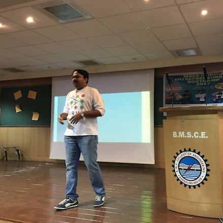

## Anush Sankaran
## Research Scientist
## IBM Research, India

Hi, I am Anush. This blog is my perception (read, musings!) on Machine Learning and its related topics.

My research expertise is in the applications of representation learning algorithms on noisy, unstructured data (natural language, vision), and build cognitive systems. I also specialize in end-to-end automated fingerprint comparison technology.
I'm currently leading technical efforts in two projects

1. [DARVIZ](http://darviz.mybluemix.net/#/) - Its a visual programming IDE, where you could design a deep learning model using an intuitive drag-and-drop framework. Once designed, DARVIZ could write the execution ready deep learning code for you in three platforms - Tensorflow, CAFFE, and Theano. This tool helps in extreme rapid prototyping of deep learning models and implementation of state of art papers.

2. [Machine Learning for Creativity](http://ml4creativity.mybluemix.net) - One of the elusive goals of artificial intelligence remains human-level creativity. All attempts to emulate creativity artificially fall under the umbrella of an emerging field called computational creativity. The goal of this project is to create creative assistants to help augment human creative experts in various fields

Prior to my work in IBM Research, I obtained my PhD from IIIT Delhi, India in 2017. My thesis advisors are Dr. Mayank Vatsa and Dr. Richa Singh. My thesis ("Learning Representations for Matching Fingerprint Variants") lies in the domain of applied deep learning in the problems at the intersection of biometrics and forensics.  I was awarded the prestigious TCS Research Fellowship for my PhD.