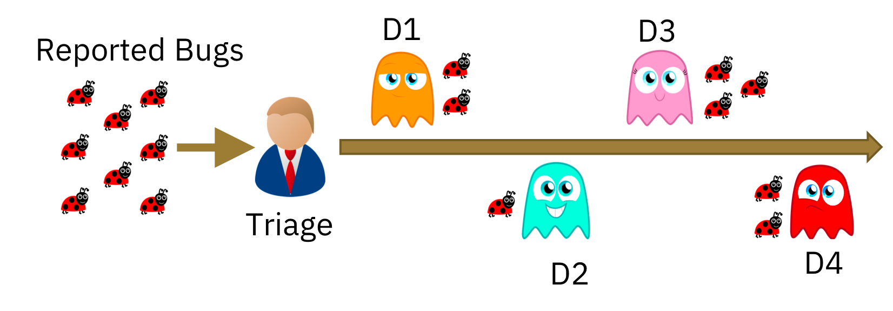

# Automated Bug Triaging 

## What is Bug Triaging:

The process of Bug Triaging is vast and elaborate. However, the minimalistic definition that we adopt for this work is,

> For a given bug report, identifying an appropriate developer who could potentially fix the bug is the primary task of bug triaging.

So, can we automate this process of bug triaging?

## What are our research questions ?

* **RQ1**: Is it feasible to perform automated bug triaging using deep learning?

* **RQ2**: How does the unsupervised feature engineering approach perform, compared to traditional feature engineering based approaches? 

* **RQ3**: How does the number of training samples per class affect the performance of the classifier?

* **RQ4**: What is the effect of using only the title of the bug report in performing triaging when compared with using the description as well?

* **RQ5**: Is transfer learning effective in this domain?

This is the goal of our research paper published in the  CoDS-COMAD 2019 "[DeepTriage: Exploring the Effectiveness of Deep Learning for Bug Triaging](https://arxiv.org/abs/1801.01275)".

Please find the [poster here](../resources/DeepTriage.pdf), that we presented in CoDS-COMAD 2019 conference. Also, the data and the initial version of the code is available [here](http://bugtriage.mybluemix.net/).

Please note that this feature is an initial proof of concept, and is not yet available as a system for open consumption.

------------

If you want to know more, do reach out to me at anussank@in.ibm.com or tweet to me @goodboyanush