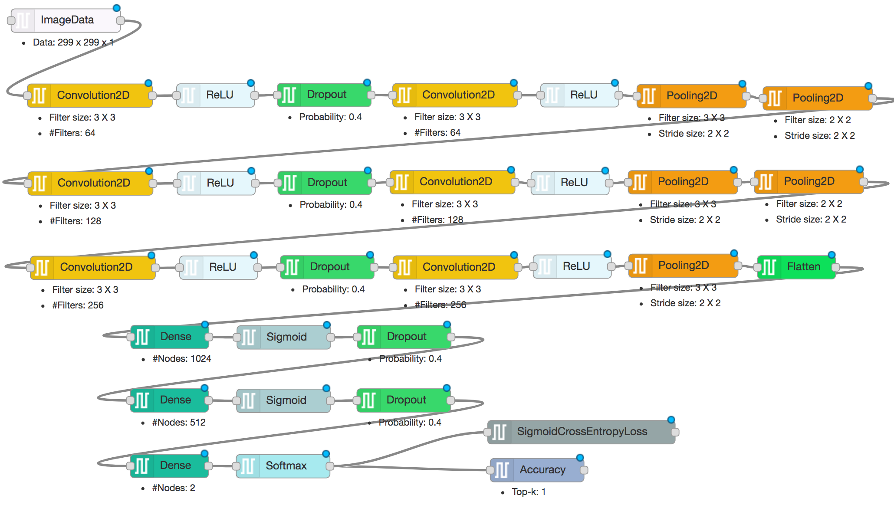

# DARVIZ - A Visual IDE for Deep Learning

## Cats vs. Dogs Classification
One of the most daunting tasks for AI over the past decade is to be able to distinguish between the image of a cat and the image of a dog (satire intended!). The problem statement that we are trying to solve is, 

```
Does the given image contain a cat or a dog?
```

Some example images are shown here

 

I am going to skip on why deep learning is the go-to solution for this problem. Also, if you want to WOW yourself on the challenge of this problem, you should definitely read this [blog post](https://googleblog.blogspot.in/2012/06/using-large-scale-brain-simulations-for.html)

## How to implement this algorithm

There are so many libraries that helps you to implement a deep learning model for the above task:

> [Tensorflow](https://github.com/kevin28520/My-TensorFlow-tutorials/tree/master/01%20cats%20vs%20dogs)

> [Keras](https://gggdomi.github.io/keras-workshop/notebook.html)

> [PyTorch](https://github.com/desimone/pytorch-cat-vs-dogs)

You are free to learn anyone (or all) these libraries and write 100's of lines of codes in them and debug the code. Ahooo!

## I don't know these libraries :(

What if I tell you, that you need not learn any of these libraries but still you can design a catsVssDogs model in just two minutes! Yahooooo!

Welcome you all to [DARVIZ](http://darviz.mybluemix.net/) ... A visual programming IDE for deep learning models. Design your deep learning model and extract the code in either Keras or Caffe today!

A highly complex deep learning model designed using DARVIZ for catsVs.Dogs task is shown below:



> Download the above [Model Design](../resources/cats_vs_dogs.dz)

> Download [Sample Data](../resources/cats_vs_dogs_data_sample.zip) for above model

> Download [Full Data](https://www.kaggle.com/c/dogs-vs-cats/data) for the above model

Steps to use this design:

1. Download the [Model Design](../resources/cats_vs_dogs.dz)
2. Login to [DARVIZ](http://darviz.mybluemix.net/) using your Gmail ID
3. Go to the **Create Design** page. On the right top corner of the Editor window, click on Properties -> Import From -> Darviz representation
4. Edit the design visually and Save the design
5. Go to the **Create Source Code** page. Generate the source code for the design you created in the library of your choice!

That's it! Deep learning development is that simple now! Once you have downloaded the source, you can execute it any machine (GPU/ CPU) that have!

View and comments, please reach out to us at, ibmdarviz@gmail.com