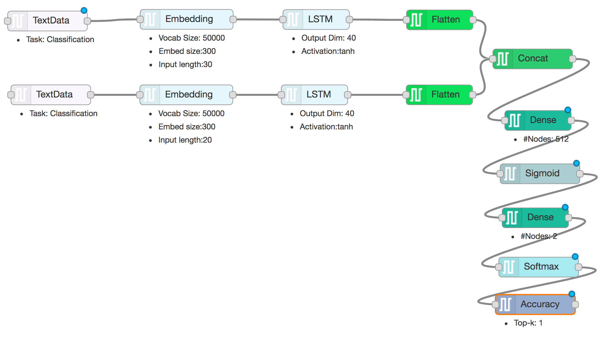

# DARVIZ - A Visual IDE for Deep Learning

## Semantic sentence similarity
A common task that all of us face while working with natural language processing is:

```
Given two sentences, how semantically similar are the two sentences?
```

Consider the following example to explain what semantic sentence similarity means,

| sentence 1       | sentence 2          | similarity score |
|:-----------------|:--------------------|:-----------------|
| china-u.s. and   | sino-us and         | 1                |
| fast , easy and  | quick , easy and    | 1                |
| as holy as       | as sacred as        | 1                |
| My name is Anush | I am a good boy     | 0                |


Two sentences may not have the same vocabulary words or may not have the same lexical structure. Still, when we read the sentence, we know, that they have the same semantic meaning due to the presence of synonyms. Such semantically similar sentences can be marked as **1**. While semantically non-similar sentences are marked as **0**

## How to address this problem?

Traditionally, many works have tried to address this problem using [n-grams](https://pdfs.semanticscholar.org/975a/bd66487a529ba37402ea4eb5a09fd0e20b85.pdf), [Knowledge Graphs](https://e-space.mmu.ac.uk/94900/1/Sentence+Similarity+Based+on+Semantic+Nets+and++Corpus+Statistics+10-1109tkde-2006-130-authors-accepted-version%5b1%5d.pdf), and [Vector Representaions](https://pdfs.semanticscholar.org/d265/8b49c9cba95ec997a0341fa1ce7a4cb7f557.pdf). Recently, [deep learning](http://papers.nips.cc/paper/5950-skip-thought-vectors.pdf) is taking over the state-of-the-art results in the task of semantic sentence similarity, as well (no surprises there!). 

Hence, if you are trying to address this problem, deep learning would probably the way for you to go forward.

## Deep learning algorithm overview

The reason for the success of deep learning in such tasks is because of the following reasons:

1. Distributional representation of language: Using a big corpus of text documents, distributional learning helps us to learn global deep relationship among the words. Just an abstract example - the reason a particular word occured in the fourth line of a document, may be semantically related to the first line.
2. Word embeddings: Following distributional hypothesis, an word embedding step provides a **fixed-length** representation for every word in our document corpus. Further, unique property is that semantically similary words, such as pizza and pasta, will have very similar representations.
3. Sentence embedddings: Going from words to sentences, it is essential to maintain the syntactic structure and not just the semantic meaning. A recurrent neural network uses the word embeddings obtained in the previous step to obtain a **fixed-length** representation for the whole sentence and not just a word.

## How to implement this algorithm

There are so many libraries that helps you to implement such a sentence similarity model using deep learning techniques. Some example implementations available are: 

> [Tensorflow](https://github.com/dhwajraj/deep-siamese-text-similarity)

> [Keras](https://github.com/airalcorn2/Deep-Semantic-Similarity-Model)

> [PyTorch](https://github.com/demelin/Sentence-similarity-classifier-for-pyTorch)

You are free to learn anyone (or all) these libraries and write 100's of lines of codes in them and debug the code to create a sentence similarity model. Ahooo!

## I don't know these libraries :(

What if I tell you, that you need not learn any of these libraries but still you can design such sentence similarity model in just two minutes! Yahooooo!

Welcome you all to [DARVIZ](http://darviz.mybluemix.net/) ... A visual programming IDE for deep learning models. Design your deep learning model and extract the code in either Keras or Caffe today!

A sentence similarity model designed using DARVIZ is shown below:



> Download the above [Model Design](../resources/sentence_similarity.dz)

> Download [Sample Data](../resources/sentence_similarity_data.txt) for above model

Steps to use this design:

1. Download the [Model Design](../resources/sentence_similarity.dz)
2. Login to [DARVIZ](http://darviz.mybluemix.net/) using your Gmail ID
3. Go to the **Create Design** page. On the right top corner of the Editor window, click on Properties -> Import From -> Darviz representation
4. Edit the design visually and Save the design
5. Go to the **Create Source Code** page. Generate the source code for the design you created in the library of your choice!

That's it! Deep learning development is that simple now! Once you have downloaded the source, you can execute it any machine (GPU/ CPU) that have!

View and comments, please reach out to us at, ibmdarviz@gmail.com

