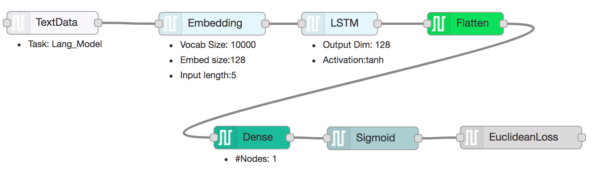

# DARVIZ - A Visual IDE for Deep Learning

## Natural Language Regression
While working with natural langauge processing, we often come across the task of predicting a continuous valued integer output for a given input sentence. This includes tasks such as (i) sentiment prediction for a statement, (ii) impact prediction of a title, (iii) grammatical correctness of a sentence, (iv) importance of a tweet, and many more. This is commonly called as natural language regression and can be formally formulated as follows,

```
Given a natural langauge sentence, predict a real numbered output.
```

Consider the following example which provides the social impact of a movie title,

|  Movie title     | Impact              | 
|:-----------------|:--------------------|
| Terminator       | 0.6				 | 
| Before sunrise   | 0.3                 | 
| La la land       | 0.9                 | 
| My fair lady     | 0.7                 | 


And yet again, deep learning has provided some recent success in regression problems and the motivation of which is out of scope of this post (however, you could refer to my [previous post](https://goodboyanush.github.io/blogs/darviz_text_classification.html)). 

## How to implement this algorithm

There are so many libraries that helps you to implement such a sentence regression model using deep learning techniques. Some example implementations available are: 

> [Tensorflow](https://medium.com/@ilblackdragon/tensorflow-text-classification-615198df9231)

> [Keras](https://medium.freecodecamp.org/big-picture-machine-learning-classifying-text-with-neural-networks-and-tensorflow-d94036ac2274)

> [PyTorch](https://github.com/spro/practical-pytorch/blob/master/char-rnn-classification/char-rnn-classification.ipynb)

You are free to learn anyone (or all) these libraries and write 100's of lines of codes in them and debug the code to create a sentence regression model. Ahooo!

## I don't know these libraries :(

What if I tell you, that you need not learn any of these libraries but still you can design such deep learning model in just two minutes! Yahooooo!

Welcome you all to [DARVIZ](http://darviz.mybluemix.net/) ... A visual programming IDE for deep learning models. Design your deep learning model and extract the code in either Keras or Caffe today!

A sentence regression model designed using DARVIZ is shown below:



> Download the above [Model Design](../resources/sentence_regression.dz)

> Download [Sample Data](../resources/sentence_regression_data.txt) for above model

Steps to use this design:

1. Download the [Model Design](../resources/sentence_regression.dz)
2. Login to [DARVIZ](http://darviz.mybluemix.net/) using your Gmail ID
3. Go to the **Create Design** page. On the right top corner of the Editor window, click on Properties -> Import From -> Darviz representation
4. Edit the design visually and Save the design
5. Go to the **Create Source Code** page. Generate the source code for the design you created in the library of your choice!

That's it! Deep learning development is that simple now! Once you have downloaded the source, you can execute it any machine (GPU/ CPU) that have!

View and comments, please reach out to us at, ibmdarviz@gmail.com

