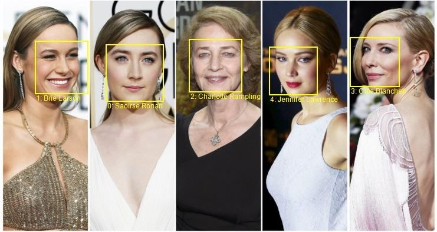
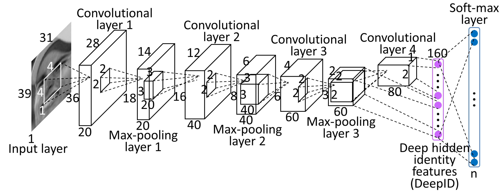
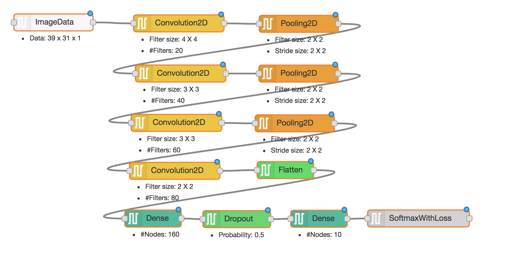

# DL-IDE - A Visual IDE for Deep Learning

## Face Recognition

One of the popular applications often used by researchers to study the cognitive capacity of a artifically intelligent algorithm is recognizing human faces. Human face recognition is one such application which is very natural and easy for humans, while highly challenging to replicate artificially. The problem we are trying to solve is

```
Given the image containing the face of a person, identify the person's identity
```

Some example images from the [MS Celeb 1M dataset](https://www.microsoft.com/en-us/research/project/ms-celeb-1m-challenge-recognizing-one-million-celebrities-real-world/) are shown here

 

I am going to skip on why deep learning is the go-to solution for this problem. Also, if you want to WOW yourself, watch the working [live demo](http://zeus.robots.ox.ac.uk/portraitmatcher/)

## How to implement a DL based face recognition algorithm

Consider a benchmark algorithm in face recognition using deep learning called as `Deep ID` (Paper [here](http://mmlab.ie.cuhk.edu.hk/pdf/YiSun_CVPR14.pdf)). What is the quickest way to implement the deep learning design model ? Would I be able to implement the deep learning model without doing/ knowing much coding ?

Welcome you all to [DL-IDE](http://dlide.mybluemix.net/) ... A visual programming IDE for deep learning models. Design your deep learning model and extract the code in either Keras or Caffe today!

The model that is explained in the paper is shown below,



and, the model could be designed in DL-IDE as follows



> Watch how to do [video](https://www.youtube.com/watch?v=k-UygtFy8Q8&t=108s)

> Download the above [Model Design](../resources/deepid.dz)

Steps to use this design:

1. Download the [Model Design](../resources/deepid.dz)
2. Login to [DL-IDE](http://dlide.mybluemix.net/) using your Gmail ID
3. Go to the **Create Design** page. On the right top corner of the Editor window, click on Properties -> Import From -> Darviz representation
4. Edit the design visually and Save the design
5. Go to the **Create Source Code** page. Generate the source code for the design you created in the library of your choice!

That's it! Deep learning development is that simple now! Once you have downloaded the source, you can execute it any machine (GPU/ CPU) that have!

## Import the Caffe Implementation

The Caffe implementation of the DeepID paper is available [here](https://github.com/joyhuang9473/deepid-implementation). You could directly import the Caffe implementation into the DL-IDE designer.

> Watch how to do [video](https://www.youtube.com/watch?v=k-UygtFy8Q8&t=193s)

Steps to import the Caffe implementation:

1. Download the [Caffe implementation](https://github.com/joyhuang9473/deepid-implementation)
2. Login to [DL-IDE](http://dlide.mybluemix.net/) using your Gmail ID
3. Go to the **Create Design** page. On the right top corner of the Editor window, click on Properties -> Import From -> Caffe
4. Upload the Caffe solver file and the Caffe network file
4. Edit the design visually and Save the design
5. Go to the **Create Source Code** page. Generate the source code for the design you created in the library of your choice!

