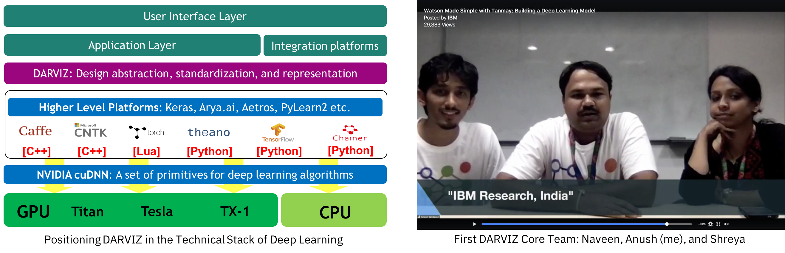
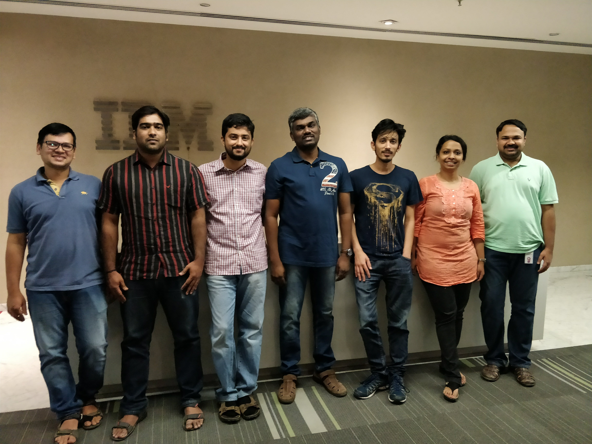

# A Journey from Weekend Project to Watson Product

(Read: 15 mins)

**Disclaimer**: This blog gives a personal POV to a 1.5 year long journey of how a small weekend project idea evolved and eventually went into a Watson product (Watson Studio). There are many other equally compelling perspectives through which the same journey can be shared. A special acknowledgement to Naveen, Shreya, Senthil, Rahul, Neelamadhav, and Srikanth for being the co-passengers through this journey.

------------

"Seriously? Just by changing the order of layers or few parameters, there is a huge boost in accuracy?"

"There should be a place where I could quickly play around with different configurations of deep learning models without the need for learning complex code syntax ..."

These were some of the questions asked by my manager, [Senthil Mani](https://researcher.watson.ibm.com/researcher/view.php?person=in-sentmani), when we were trying to solve the problem of [automated bug triaging](http://bugtriage.mybluemix.net/) in enterprise support systems using deep learning models (specifically, attention based bi-directional RNNs). Not only Senthil, but most of the expert software engineers, programmers, developers would ask the same questions when they glance at deep learning for the first time.

It was around July 2016, seven months into my first industry job @ IBM Research and fresh out of my grad school. Though it does not seem very far behind, that was the time when multiple deep learning libraries (Tensorflow, Keras, CNTK, Torch, Chainer, Lasagne (Theano), MxNet etc.) were racing against each other to capture the market. To add some perspective, PyTorch was not even released then. Being in a research lab, you were considered "cool" if you called yourself an expert in the latest deep learning library in the market. Alas, it was not so cool for so many others, who were new into deep learning or just wanted to consume deep learning to solve some of their traditional research problems.

Deep learning at a mathematical level can be hard to understand, but at a usage or consumption level should be highly intuitive and straight forward. This was the tiny spark that kept my nights and weekends busy for four continuous weeks. Being a total noob in building full stack applications, this was an opportunity for me to learn and build. The end of the first four week journey, resulted in what went by multiple names - `iDeep`, `dl-middleware`, and my personal favorite `DIY Deep Learning` (Do-It-Yourself Deep Learning). And the system looked like the following video,

This intuitive UI system could then generate the Caffe protobuf files for the designed DL model. Different teams in my working floor could realize and appreciate the need for such an intuitive UI system to design deep learning models. And some folks used it as well! That was an encouragement. With some blatant advertisement inside the organization and some luck, we got the first working team - Me, Naveen Panwar, and Shreya Khare (with some stretch support from Rahul AR and Neelamadhav). That feeling when you need not work all night and in weekends, and could do your night work in the day and sleep in the night - is such a relief! The first `git push` was made on Oct 10, 2016 (on my Father's birthday - a big dedication to him!).

The first task was to name the system and all of us being great movie-buffs, our fantasy aim was to create a system equivalent to JARVIS (read, Iron-Man). Thus, came our name `Deep JARVIS` or `DARVIZ` acronymed as `Deep Abstract Representation, Visualization, and Verification`. The first core team and how we technically placed DARVIZ initially in the stack of deep learning models is shown below,

 

And yes! We printed t-shirts too for DARVIZ, because we are so-cool!

It was a mini-startup like environment with three of us trying to learn and build things on the fly. Coming from a research lab, building a working system was not enough - it warranted more scientific, rigorous, and methodical approach. We conducted elaborate user studies to understand their requirements for such a system and also to verify the need of certain features. The results of this study fetched our first research paper in this problem - `"DARVIZ: Deep Abstract Representation, Visualization, and Verification of Deep Learning Models"` [paper link](https://arxiv.org/pdf/1708.04915.pdf) in ICSE-NEIR 2017. 

This paper gave us the much needed momentum and by the end of 2016, we had our first intuitive drag-and-drop style of model designing system ready, and it looked beautiful:

Cometh 2017 with some new and broad challenges. We zigzagged between multiple long-term plans for DARVIZ. Some of the strong candidates were:

1. DARVIZ could be a potential teaching tool in academia. Hence, make a free easy-to-use system for students and easy-to-teach system for faculty.

2. DARVIZ could help a whole team of developers to quickly build prototypes in mid-scale and large-scale enterprises. Hence, create a fully supported product and create a revenue source from it.

3. DARVIZ could be fully open sourced and the development can continue with a strong support from the community.

Everyone I discussed with, had a strong opinion of what is the correct path to go through. And honestly, all of these arguments were correct.
While we could do all three of them simultaneously, we started with plan #1 - as that was the least resistance path. And we did that in real quick time - on Feb 19, 2017 (on my Mom's birthday - a big big dedication to her as well) the first external release was DARVIZ was made - [DARVIZ](http://darviz.mybluemix.net/). It was a very special day to release DARVIZ to the external audience for the first time in a summer school ([MLIB](http://iab-rubric.org/mlib2017/sponsors.html)) organized by my grad school advisors. 14 months after getting out of the grad school, going back to release + present the product you were working on - was a perfect circle of grad life feeling! The first public version is shown below,

And yes! By now we had our own logo for DARVIZ, because we are so-cool!

The product was a huge success. Almost everyone who attended the summer school appreciated the effort and the need. This pushed us to make this as our primary target for the remaining of the year. We held an aggressive set of roadshows across India and visited different universities, spreading the word of the availability a free-to-use, easy-to-design, no-need-to-write-code tool for deep learning. Looking back, it is such an enormous feeling to know I presented DARVIZ at more than 10 different universities/ conference within a single year.

1. On Feb 19th, released DARVIZ in a tutorial session in "Winter School on Machine Learning in Biometrics" (MLIB).
2. On March 7th, presented DARVIZ at IIT-M to the student community. It was a part of the "industry talk" session to IIT-M students.
3. On Apr 22nd, presented and demonstrated DARVIZ to the grad students at MSRIT.
4. On Apr 25th, conducted a one day workshop on "What the fun is deep learning?" along with a hands on demonstration of DARVIZ to an audience of 40 faculty members, as a party of "Faculty Eminence Workshop". The workshop happened at CIT, Coimbatore (my alma mater).
5. On May 8th, conducted a one hour session to about 80 grad students and software engineers at the computer science department at IISC.
6. On June 3rd, conducted a one hour session as well as a demonstration booth at "IEEE-IISc Deep Learning Summit" held at IISC.
7. On July 13th, conducted a one hour industry session at "Summer School on Machine Learning" held at IIIT Hyderabad. More than 100 grad students, professors, industry practitioners from India attended that event.
8. On July 20th, conducted a two hour session at "IEEE Make in India Entrepreneurship Bootcamp" held in BMS College of Engineering for a set of curated 30 startups in Bangalore.
9. On Aug 28, in the 4th episode of "Watson Made Simple" with Tanmya Bhakshi, co-presented in an IBM Facebook live event on Deep Learning development using DARVIZ. [Link to the Video](https://www.facebook.com/IBM/videos/1465876830169261/)
10. On 16th December, conducted a tutorial, “The Journey from Shallow to Deep Learning” at NCVPRIPG 2017 with Dr. Aditya Nigam and Dr. Chandra Mouli.
11. On Feb 1st week 2018, presented DARVIZ in multiple avenues in the AAAI 2018 conference.

Eventually, this concept of easy designing of deep learning models was catching up in the community and by mid 2017, we had a few healthy competitors. Innovation is at the heart of what we were doing and we really wanted to do the next big `WOW` feature in DARVIZ. From our experience, we understood that the common way of designing deep learning models is to follow a closely related research paper and make some incremental changes on top of it. We asked a simple yet ambitious question - `"Why can't an AI system read a research paper directly and implement it?"`. We thus formulated `DLPaper2Code` and an energetic summer intern, Akshay Sethi, worked with us to kick-start this idea. This work gained us a lot of traction inside IBM Research and also in the research community with one full paper in AAAI, 2018, `"DLPaper2Code: Auto-generation of Code from Deep Learning Research Papers"` and one demo paper in AAAI, 2018, `"Democratization of Deep Learning using DARVIZ"`. By the end of the year DARVIZ reached a much more mature state and looked like the one below,

And yes! we made our own video for DARVIZ, because we are so-cool!

The constant hardwork, the initial acceptance of this tool from the student community, acceptance of a few research papers over the year, the string of roadshows, talks, conference presentations, and some blatant advertisement landed us with the opportunity to finally integrate DARVIZ into the Watson product. The legal clearance provided the product an official name - `IBM Deep Learning IDE (DL-IDE)`. A three month deadline was provided to integrate `DL-IDE` into Watson Studio as `Neural Network Modeller`. Two more colleagues joined the team - Rahul and Srikanth. Under the management of Senthil, it was now five of us who literally re-implemented the entire backend of `DL-IDE` in three months with best practices to realize it in Watson Studio. A huge vote of thanks to the Watson dev team to work with us and make this happen! On a fine morning of March 20, 2018 the `Neural Network Modeller` was released in the [IBM Think 2018](https://www.ibm.com/events/think/watch/replay/113738741/) event and the final product looked like this,

Looking back, this evolution from the simple tool, that I started building over a couple of weekends, into a team of 6 people to contribute back to Watson Studio has been really a dream run. There were lots of ups and downs over the year. Many people gave us genuine criticism that threw us off guard sometimes. The alarming growth of the community and competition gave us a scare. There were times when we almost decided to give up on this idea and move on with orthogonal problems and domains. Inspite of all these challenges, only the sheer resilience of the team's belief in this idea and motivation to democratize deep learning model designing, kept us going. There were many weeks (not just days!) where we had to continuously work overnight to meet some deadlines and stay ahead in the competition. If it was not for the team effort and also the highly energetic and happy nature of the team (especially Naveen and Shreya) - we never felt the pressure of work and always enjoyed it!

A couple of external posts on `Neural Network Modeller (NNM)`:

* Blog post on NNM: [Link](https://medium.com/ibm-watson/accelerate-your-deep-learning-experiments-with-ibms-neural-network-modeler-dd0c92fba814)

* A small video tutorial on NNM: [Link](https://medium.com/ibm-watson/ibm-watson-studio-in-10-videos-6acf96cc60)

* Use NNM here: [Link](https://datascience.ibm.com/)

* More info on Watson Studio: [Link](https://medium.com/ibm-watson/introducing-ibm-watson-studio-e93638f0bb47)

The entire team of `IBM Deep Learning IDE`:

 

(From left): Neelamadhav, Srikanth, Rahul, Senthil, Naveen, Shreya, Anush

PS: A special thanks to Tanmay Bhakshi, one of the youngest Watson & Cognitive developers, to share our vision and also promote IBM DL-IDE in multiple stage events! To highlight here is a tutorial video from the popular `TanmayTeaches` YouTube channel: [Deep Learning & Neural Networks: Using IBM DARVIZ as a Deep Learning IDE!](https://www.youtube.com/watch?v=mmRw_MuMPC4)