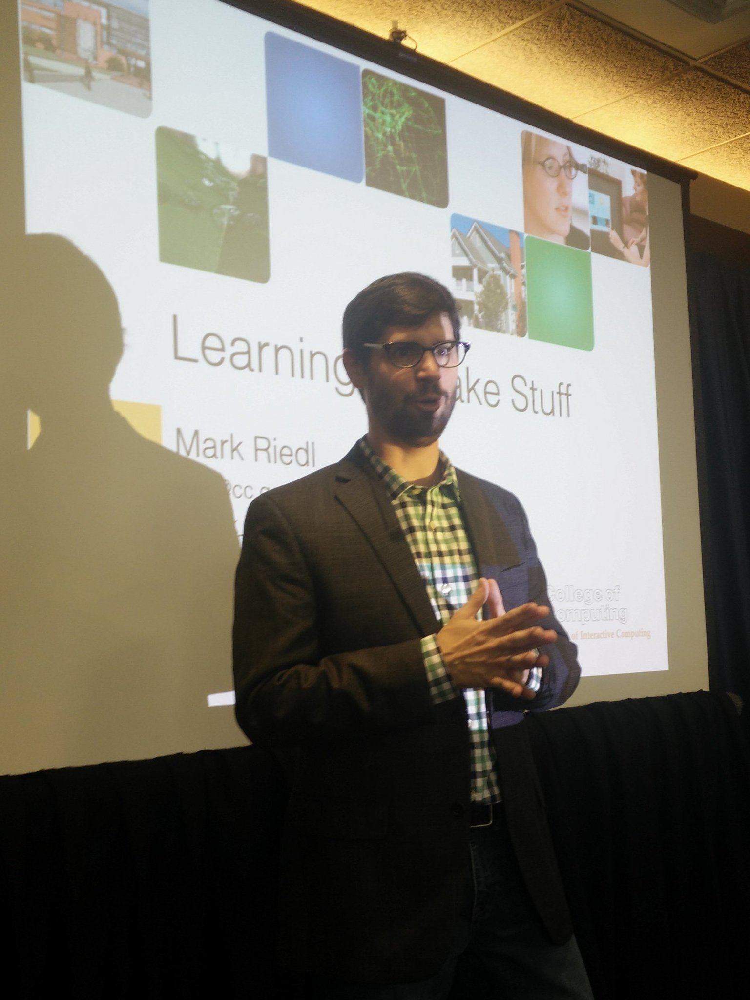
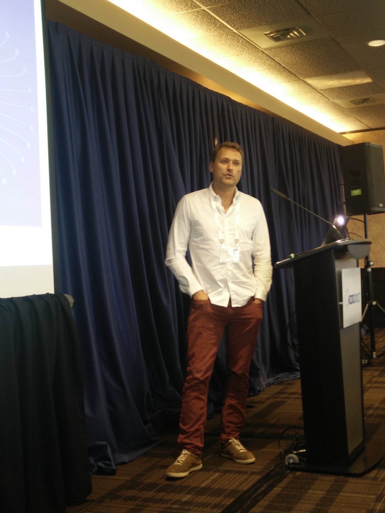
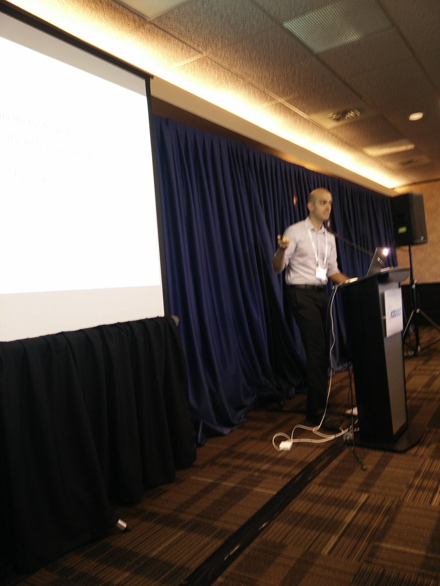
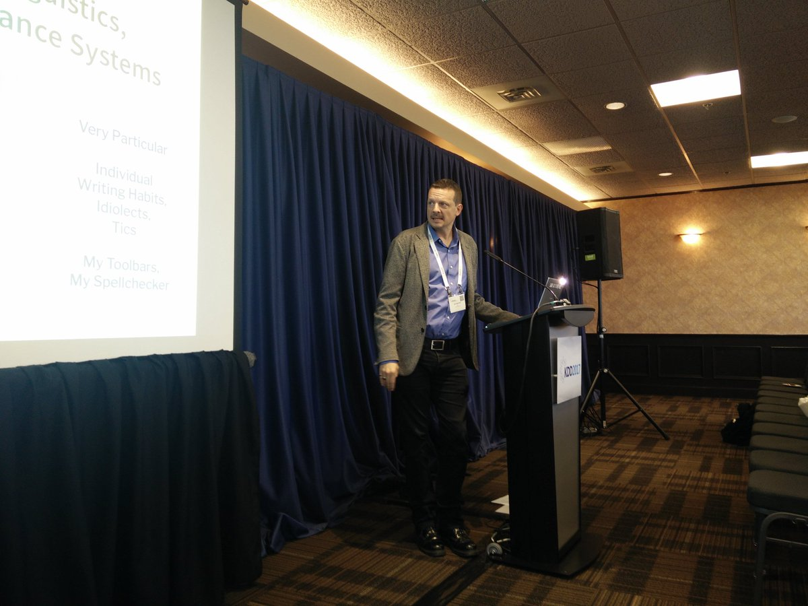
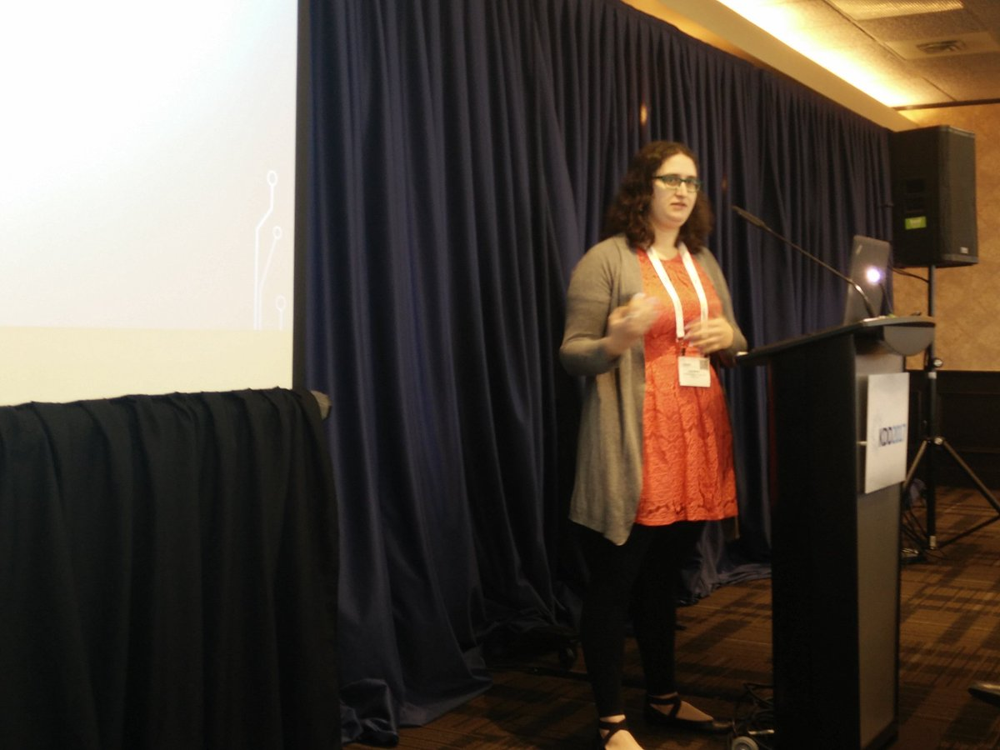
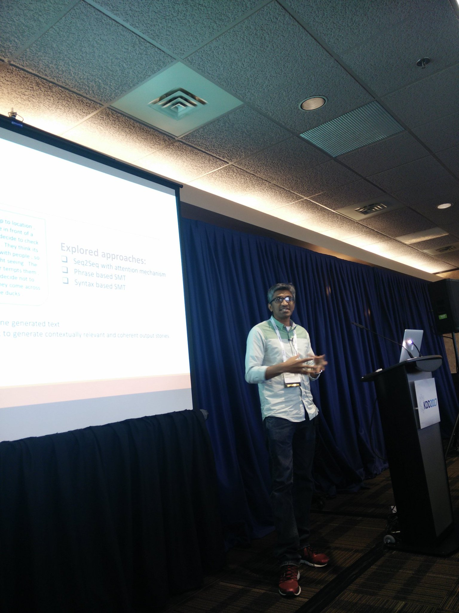
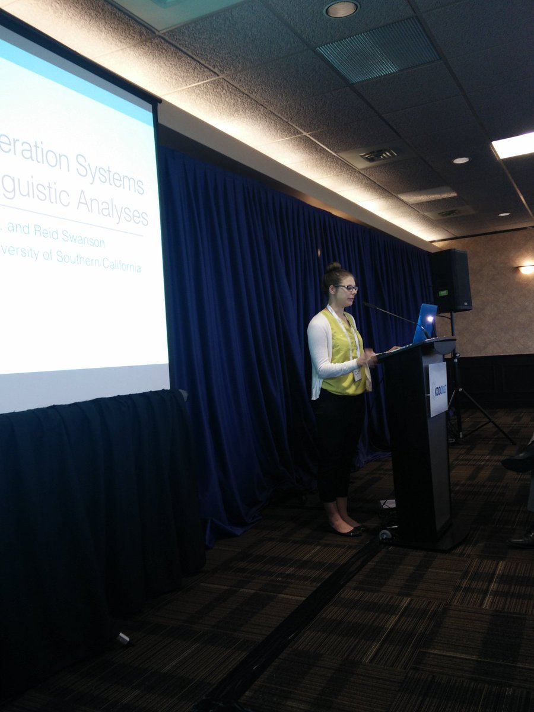
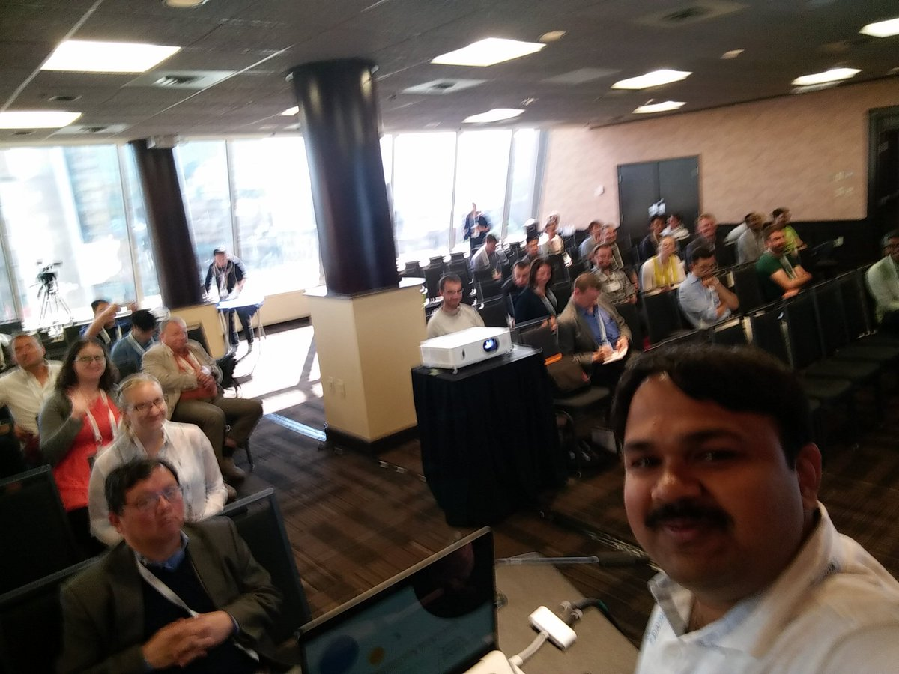

## ML4Creativity - Workshop @ KDD-2017, Halifax, Canada

Located in a suite facing the scenic ocean, this workshop started very early in the morning at 8am. We had four interesting and highly diverse (Gaming, Flavours, Fragrance, Culture ... ) keynote talks,
<ul>
<li><a href="">Mark Riedl</a>, <i>Learning to Make Stuff</i>  </li>
</ul> 

<ul>
<li><a href="">Eric Bruno</a>, <i>The World of Smell</i></li>
</ul>

<ul>
<li><a href="">Flavio Calmon</a>, <i>Challenges in Industry Level growth of computational creativity"</i></li>
</ul>

<ul>
<li><a href="">Nick Montfort</a>, <i>C-Creativity</i></li>
</ul>

Along with the keynotes, we had four interesting (not so diverse!) oral presentations,
<ul>
<li><a href="https://ml4creativity.mybluemix.net/papers/MartinEtAl-Event_Representations_for_Automated_Story-camera_ready.pdf">Event Representations for Automated Story Generation with Deep Neural Nets</a></li>
</ul>

<ul>
<li><a href="https://ml4creativity.mybluemix.net/papers/ML4Creativity-Submission11-CameraReady.pdf">Story Generation from Sequence of Independent Short Descriptions</a></li>
</ul>

<ul>
<li><a href="https://ml4creativity.mybluemix.net/papers/fiction_generation.pdf">Evaluating Story Generation Systems Using Automated Linguistic Analyses</a></li>
</ul>

<ul>
<li><a href="https://ml4creativity.mybluemix.net/papers/mani_MovieVisualization.pdf">mAnI: Movie Amalgamation using Neural Imitation; Visualizing the Movie while Reading a Book</a></li>
</ul>

## Key Observations

Some of the key observations, learnings, and take-aways, that are learnt from this workshop are:

<ol>
<li>Definition of Computational Creativity is still open!</li>
<li>All the four oral papers were related to story generation!</li>
<li>Context is the key for getting creative!</li>
<li>Automated evaluation is hard. Human evaluation is still the practice!</li>
<li>Current applications of machine learning are design aides and not designers</li>
<li>Creativity at industry/ enterprise scale is highly challenging</li>
<li>Culture has huge implications in building creative systems!</li>
<li>Goal formulation and curiosity are essential for creative AI systems</li>
<li>Intentionality is critical for creative work</li>
</ol>

Having said that, it was really an exciting couple of hours. Learnt a lot about different applications and implications of creative systems, that would have taken weeks for me to catch up browsing through literature. Looking forward to meeting all those interesting folks again, soon! 

