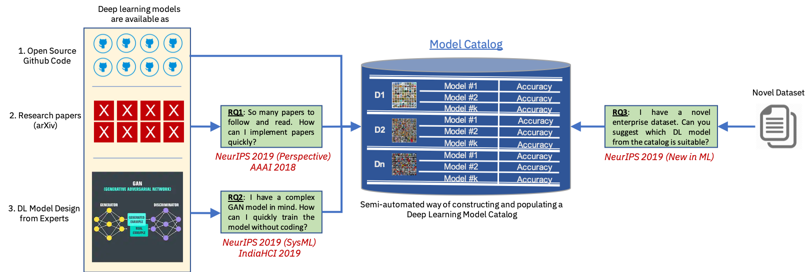

# Democratization of Deep Learning - #NeurIPS 2019

Deep learning is one of the most penetrating technologies into various domains, problem areas, and challenges. However, whether you are a student, or a practictioner, or a researcher, or a software engineer, or a business user, you must have asked one of the following questions, or faced one of the following challenges:

* NeurIPS 2019 has 1430 accepted papers ([cite](https://medium.com/@NeurIPSConf/behind-the-program-for-reproducibility-at-neurips-2019-8a020e57bfd9)) and roughly about 70-100 of them have made their code publicly available ([cite](https://www.paperdigest.org/2019/11/neurips-2019-papers-with-code-data/)). How will I keep up with the exponential growth of papers and also, implement many relevant papers?

* I have novel idea for a DL model architecture in my mind. If I have to implement the DL model, I need expert level knowledge of one of the following DL libraries: Tensorflow, Keras, PyTorch, Caffe etc. Can I reduce the requirement of expertise level and implementation time for rapid prototyping DL model architectures?

* I have a novel dataset, maybe an enterprise dataset or a dataset for a novel problem. There are so many different DL models out there, with different pros and cons. How would I easily decide, without wasting both my time and computational resources, which is the best DL model for my dataset?

To address all these challenging research questions, we are working on `Democratization of Deep learning` with a singular motive of making deep learning available to everyone, irrespective of their usecases and expertise levels.

The above picture, summarizes our entire view on deep learning democratization, highlighting a few blocks that we have converted into #NeurIPS2019 papers.

## RQ1: So many papers to follow and read. How can I implement papers quickly? 

Given the PDF of a deep learning research paper, either from conference proceedings or arXiv, can we automatically implement the research paper and provide an execution ready code? With this as the ambitious motive, and to make practitioners life much easy, we worked on our solution `DLPaper2Code`. There is so much I understood on how researchers write DL papers for conferences and journals. There is a contrasting difference between the original classroom concept of the DL model and its correspondence in the formal written publication. I have summarized and discussed many of my thoughts in the original paper, as well as on my retrospectives in NeurIPS 2019.

**AAAI 2018 paper:** [DLPaper2Code: Auto-generation of Code from Deep Learning Research Papers](https://arxiv.org/abs/1711.03543)

**Video Link:** [IBM Deep Learning IDE (DL-IDE)](https://www.youtube.com/watch?v=k-UygtFy8Q8)

**My Retrospectives in NeurIPS:** [Link](https://ml-retrospectives.github.io/neurips2019/accepted_retrospectives/2019/dlpaper2code/)

## RQ2: I have a complex GAN model in mind. How can I quickly train the model without coding?

Coding GAN models require expert level understanding of DL libraries such as Tensorflow, Keras, PyTorch etc. We developed a `no-code` platform for designing a GAN model. Just create a highly customizable and abstract JSON representation of GAN model. We will automatically create a PyTorch GAN model from the JSON and train the GAN model, on any provided dataset.

**Paper PDF:** [AuthorGAN: Improving GAN Reproducibility using a Modular GAN Framework](https://arxiv.org/abs/1911.13250) (MLSys: Workshop on Systems for ML)

**Open Source Code:** [Code Link](https://developer.ibm.com/patterns/supplement-nnm-in-watson-studio-for-gan-model-with-configuration-no-code/)

**Visual Drag-and-Drop Designing of DL Models:** [IBM Neural Network Modeller on IBM Watson Studio](https://www.youtube.com/watch?v=EDQ0AWcUBnE&) - It's free! 

## RQ3: I have a novel dataset. Can you suggest which DL model from the catalog is suitable? Also, can you predict the expected performance of the DL model on the novel dataset, in a trainless manner?

Researchers work with popular benchmark datasets (such as, MNIST, CIFAR10 etc.). Results in research papers are published in these well-understood benchmark datasets. Pracitioners and industry researchers often face the struggle in bridging the gap between the results obtained in benchmark datasets and highly noisy live enterprise datasets. Research works such as [NAS (Network Architecture Search)](https://arxiv.org/abs/1808.05377) try to find a best DL model for a dataset, but at a high computational cost. Instead of spending a lot of computational resource, can we automatically recommend an existing, highly suitable DL model for the given unknown dataset? Also, can you predict the expected performance of the DL model on the novel dataset, in a trainless manner?

**Paper PDF:** ["You might also like this model": Data Driven Approach for Recommending Deep Learning Models for Unknown Image Datasets](https://arxiv.org/abs/1911.11433) (New in ML)

**Open Source Code:** [DL Model Recommend](https://github.com/goodboyanush/dl-model-recommend)

## Attending NeurIPS!

I will be attending NeurIPS 2019 conference and I am very enthusiastic in discussing my reseach with others and also, building usable systems that could democratize deep learning! 

More information about [What am I Doing in Research?](https://goodboyanush.github.io/blogs/what_am_i_doing.html)

More information about me, can be found here - [Think ML](https://goodboyanush.github.io/blogs/bio.html). 

Do not hesitate to reach out to me!
