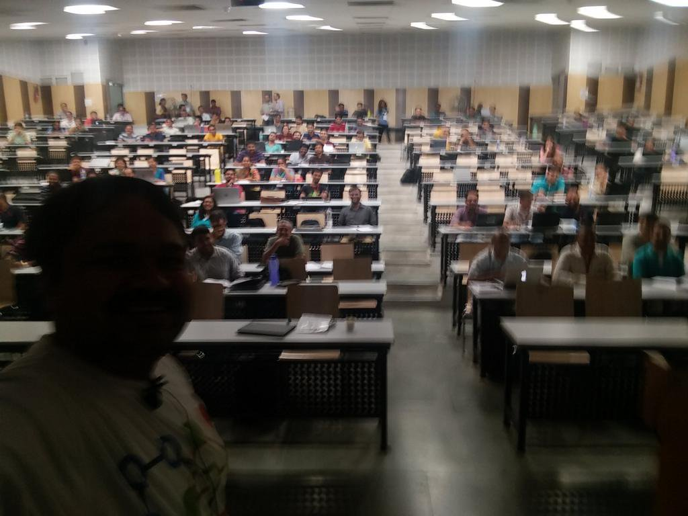
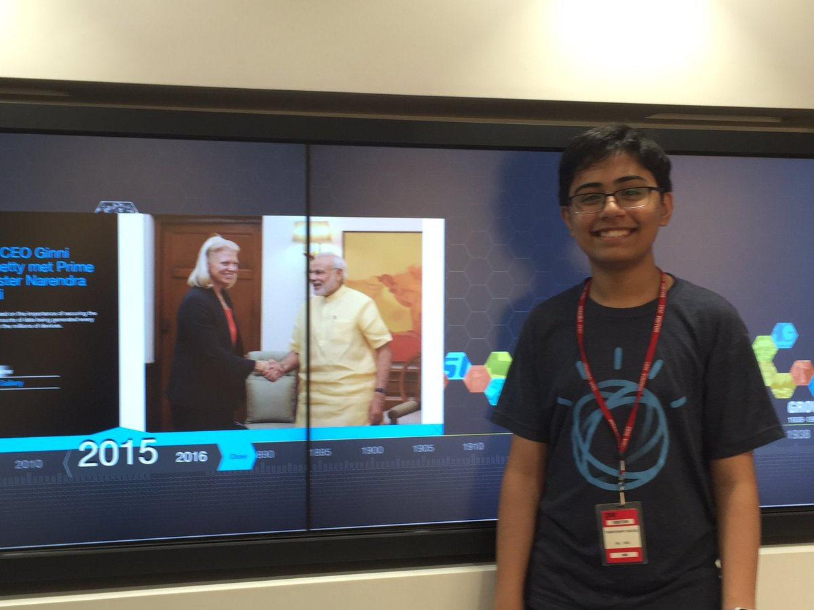
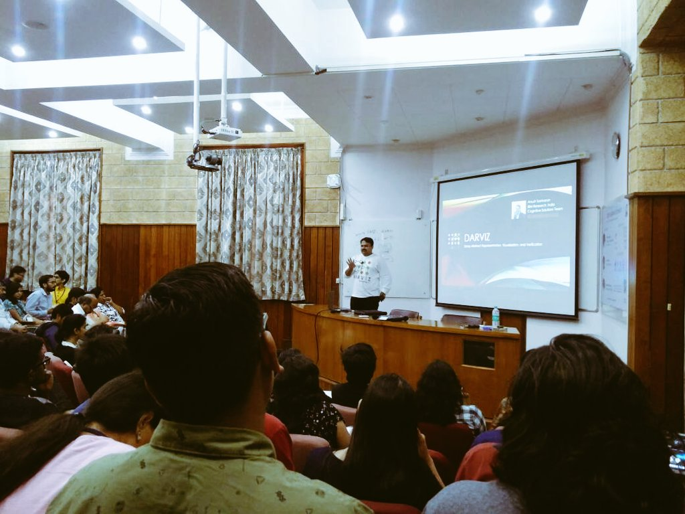
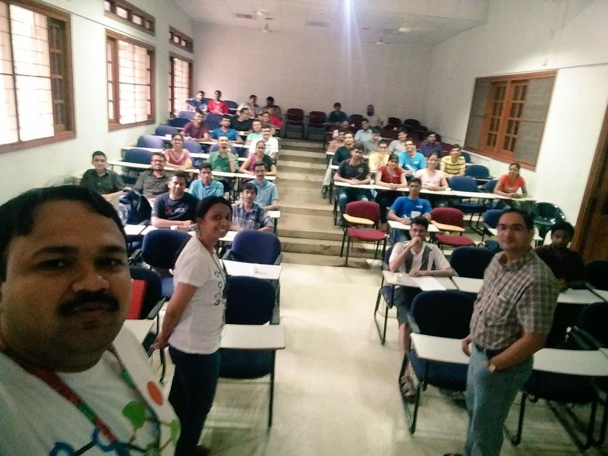
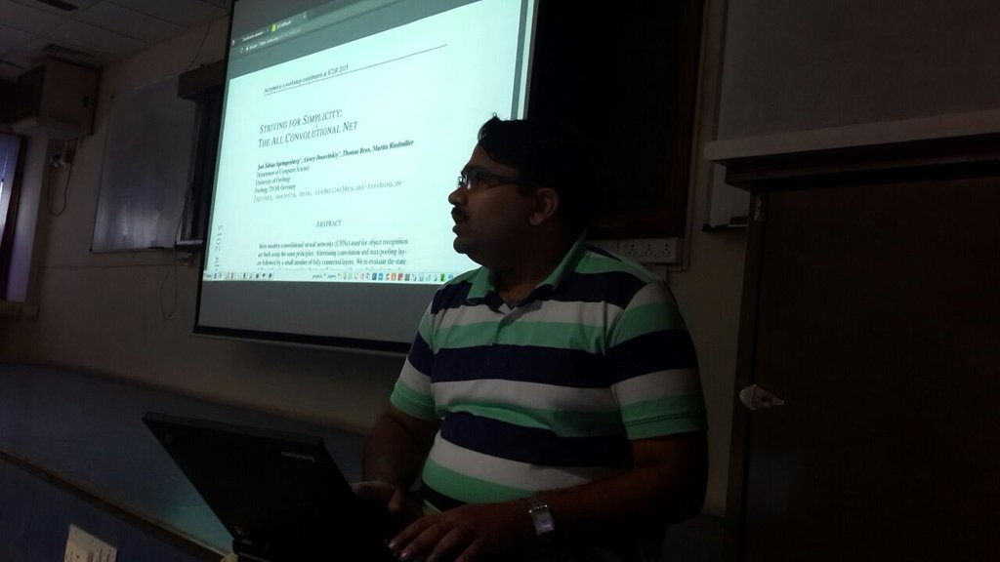

## [Jul '17] IEEE Make in India Entrepreneurship Bootcamp

A highly interactive session on "Deep learning made easy with DARVIZ" with a curated list of 30 startups in Bengaluru, India.

## [Jul '17] Summer School in Deep Learning

Presented to one of the largest grad students audience on "Research Innovations at IBM Research, India". This was a week long summer school in deep learning hosted by IIIT Hyderabad.

## [Jul '17] Interaction with Tanmay Bhakshi

The whiz-kid Tanmay Bhakshi visited us in our research lab. It was a genuine pleasure on discussing DARVIZ with him. We really hope that DARVIZ could be of use to the developer community, including Tanmay! 
> [Tanmay Teaches:  Using IBM DARVIZ as a Deep Learning IDE!](https://www.youtube.com/watch?v=mmRw_MuMPC4)

## [Jun '17] IEEE-IISc Deep learning Summit

Presented DARVIZ to a large set of focussed audience in deep learning. A good mix of academic and industry audience were present. It was good learning to find DARVIZ useful to the diverse audience.
> [IBM DARVIZ - A Platform Independent UI for Deep Learning](https://www.youtube.com/watch?v=GICAnqhvO0I)

## [May '17] Short Term Programme on Next Generation Computing

This was literally a homecoming talk for me. Seven years after I finished my undergraduation from CIT, I returned to conduct a one day course on "Deep Learning in Computer Vision" for faculty audience. 

## [May '17] IISC Bengaluru

Presented DARVIZ to about 100+ grad software engineers. The motive is to enable a quicker deep learning adoption rate for software engineers/ developers. Thanks to Dr. Aditya Kanade for hosting us! 

## [Mar '17] MSRIT Bengaluru

To a highly enthusiastic student audience, gave a light-hearted talk on "What the fun is deep learning?". Hope the students learnt something beyond my jokes!

## [Mar '17] IIT Madras

Presenting the first version of DARVIZ's capabilities to a totally surprised student audience from IIT Madras

## [Feb '17] Winter School on Machine Learning in Biometrics

Unvieling the very first version of DARVIZ to the world. A session hosted by my PhD advisors, it was a great session on presenting my first work outside of my PhD lab in front of my advisors!
[Link >]((http://iab-rubric.org/mlib2017/))

