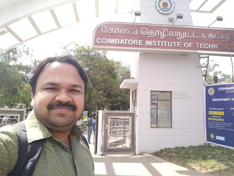
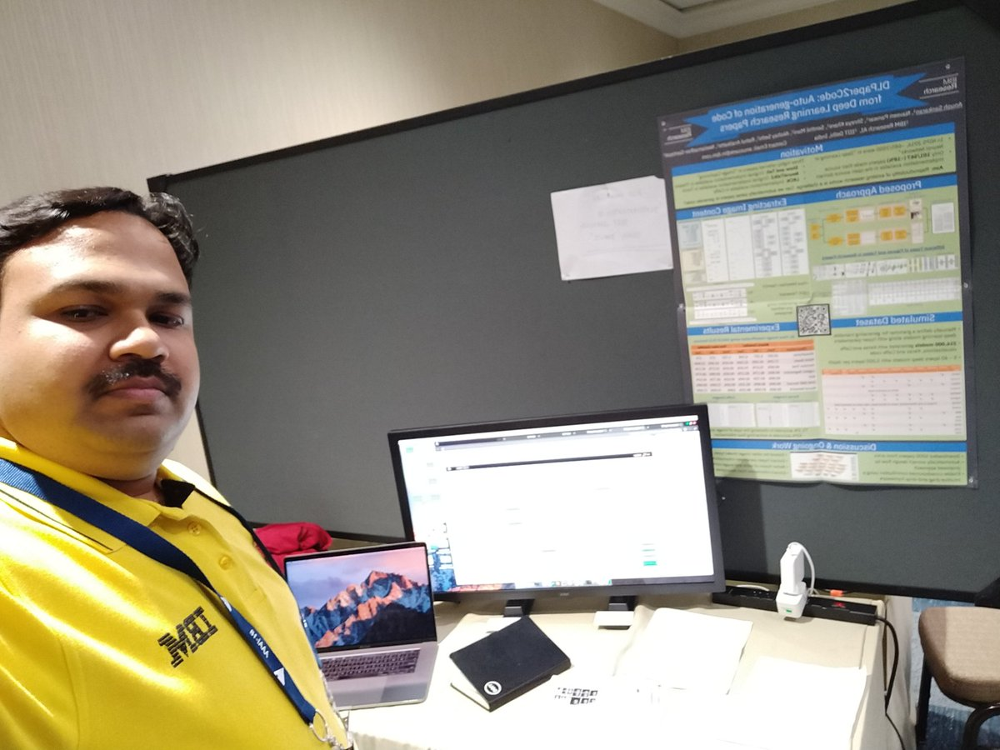

## [Mar '19] First Teaching Presentation

My formal teaching course on Visual Recognition for graduates students at IIIT Bangalore.

> 

## [Mar '19] The Path Not Taken

The challenges and paths not taken in Deep Learning research, at NWIMI workshop in IIT Jodhpur.

> 

## [Jan '19] Session Chair in CoDS-COMAD 2019

Held a session, with invited talk by Nitendra Rajput, in CoDS-COMAD, Jan 2019 at Kolkota.

> 

## [Sept '18] Workshop on Deep Learning

Yet another homecoming! Ten year before I was sitting in the same auditorium, as a student, listening to different workshop. Now, I am the presenter in the same annual workshop series, with lots of young energetic minds listening to my tutorial on "Deep Learning with Watson Studio"

> 

> 

## [July '18] NNM with Watson Studio 

Presented “NNM with Watson Studio” and GAN Toolkit at IEEE bootcamp at BMSCE - Bangalore

> 

## [Feb '18] AAAI-18 Presentation

Presented our AAAI-18 paper on "DLPaper2Code : Auto-generation of Code from Deep Learning Research Papers" and our demo paper on "Democratization of Deep Learning using DARVIZ" (now called, IBM Deep Learning IDE).

> 

> 

> 

## [Feb '18] IAAI Oral Presentation

Presented our IAAI-18 paper on "Hi, how can I help you?: Automating enterprise IT support help desks". Got the deployed system recognition award in the conference!

> 

> 

> 

## [Nov '17] What the fun is Deep Learning ?

Deep Learning - basics to advanced and how can we make our life easy with DARVIZ.

[Presentation >](../docs/DL_SKIT.ppt)

> 

## [Aug '17] Watson Made Simple with Tanmya Bhakshi

4th episode of "Watson Made Simple", joined with @TajyMany to explain how Deep Learning Models can be built without writing any code using DARVIZ. The episode was aired live in  @IBM Facebook page (https://www.facebook.com/IBM ). 

[Video link >](https://www.facebook.com/IBM/videos/1465876830169261/)

> 

## [Aug '17] Hosting and Speaking in ML4Creativity Workshop at SIGKDD 2017

Hosting the workshop on "Machine Learning for Creativity" along with colleagues from Google Brain, Sony CSL, IBM Research, and TJ Watson. 

[Read More >](blogs/ml4creativity.md)

> 

## [Aug '17] Defending my PhD Thesis

Defending my PhD Thesis, titled "Learning Representations for Fingerprint Variants". 

[Read More >](blogs/thesis.md)

> 

## [Jul '17] IEEE Make in India Entrepreneurship Bootcamp

A highly interactive session on "Deep learning made easy with DARVIZ" with a curated list of 30 startups in Bengaluru, India.

> 

## [Jul '17] Summer School in Deep Learning

Presented to one of the largest grad students audience on "Research Innovations at IBM Research, India". This was a week long summer school in deep learning hosted by IIIT Hyderabad.

> 

## [Jul '17] Interaction with Tanmay Bhakshi

The whiz-kid Tanmay Bhakshi visited us in our research lab. It was a genuine pleasure on discussing DARVIZ with him. We really hope that DARVIZ could be of use to the developer community, including Tanmay! 
> [Tanmay Teaches:  Using IBM DARVIZ as a Deep Learning IDE!](https://www.youtube.com/watch?v=mmRw_MuMPC4)

> 

## [Jun '17] IEEE-IISc Deep learning Summit

Presented DARVIZ to a large set of focussed audience in deep learning. A good mix of academic and industry audience were present. It was good learning to find DARVIZ useful to the diverse audience.
> [IBM DARVIZ - A Platform Independent UI for Deep Learning](https://www.youtube.com/watch?v=GICAnqhvO0I)

> 

## [May '17] Short Term Programme on Next Generation Computing

This was literally a homecoming talk for me. Seven years after I finished my undergraduation from CIT, I returned to conduct a one day course on "Deep Learning in Computer Vision" for faculty audience. 

> 

## [May '17] IISC Bengaluru

Presented DARVIZ to about 100+ grad software engineers. The motive is to enable a quicker deep learning adoption rate for software engineers/ developers. Thanks to Dr. Aditya Kanade for hosting us! 

> 

## [Mar '17] MSRIT Bengaluru

To a highly enthusiastic student audience, gave a light-hearted talk on "What the fun is deep learning?". Hope the students learnt something beyond my jokes!

> 

## [Mar '17] IIT Madras

Presenting the first version of DARVIZ's capabilities to a totally surprised student audience from IIT Madras

> 

## [Feb '17] Winter School on Machine Learning in Biometrics

Unvieling the very first version of DARVIZ to the world. A session hosted by my PhD advisors, it was a great session on presenting my first work outside of my PhD lab in front of my advisors!
[Link >]((http://iab-rubric.org/mlib2017/))

