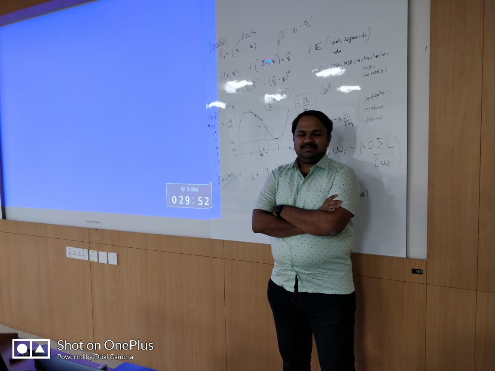
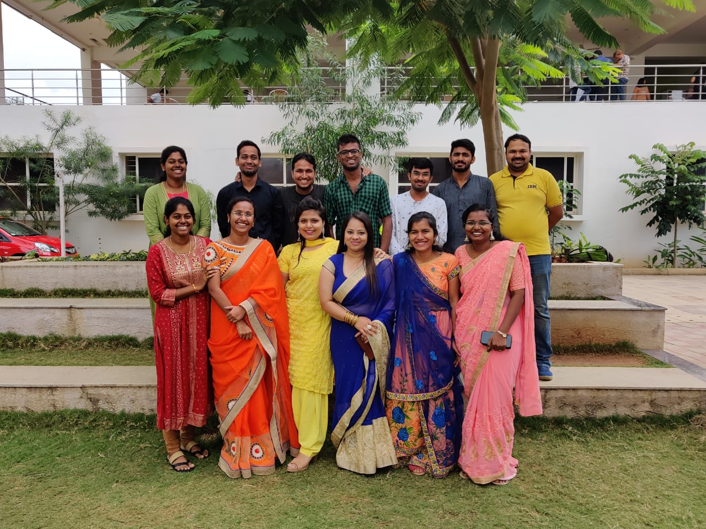

## [Mar-Apr '19] Visual Recognition (Grad Level)

### Basic Info
  - **Where**: IIIT-Bangalore
  - **When**: March/April 2019
  - **Who**: Anush Sankaran, IBM Research AI (co-instructed with Prof. Dinesh Babu Jayagopi)

> 

### Course Overview

| Lecture                        |                                    Topic                                    | Content                                                                                                                                             | Slides | Notes |
|-----------------------------|:---------------------------------------------------------------------------:|-----------------------------------------------------------------------------------------------------------------------------------------------------|--------|-------|
| 1  | Introduction to Image Classification, Neural Networks, and Optimization     | - What is visual recognition? - Logistic regression - Stochastic Gradient Descent - Multilayer perceptron  - Backpropagation - DL + ML Pipeleine |  [slides](https://github.com/goodboyanush/iiit-bangalore-march-april-2019/blob/master/Lecture-notes/Lecture-1.pdf)      |       |
| 2 | Unsupervised Feature Learning, Autoencoders, Convolutional Neural Networks  | - Popular applications of DL - Stacked autoencoders - Convolution & Pooling layers - Convolutional autoencoder                                       |  [slides](https://github.com/goodboyanush/iiit-bangalore-march-april-2019/blob/master/Lecture-notes/Lecture-2.pdf)       |   [Notebook](https://github.com/goodboyanush/iiit-bangalore-march-april-2019/blob/master/codes/conv_autoencoder_lecture_2.ipynb)    |
| 3 | Hyper-parameter optimization, Training Process                              | Convolutional neural network - One time model setup - Hyper-parameter optimization                                                                |    [slides](https://github.com/goodboyanush/iiit-bangalore-march-april-2019/blob/master/Lecture-notes/Lecture-3.pdf)     |    [Notebook](https://github.com/goodboyanush/iiit-bangalore-march-april-2019/blob/master/codes/cnn_learning_rate_lecture_3.ipynb)    |
| 4 | Different CNN Architectures                              | Data Augmentation - Transfer Learning - Comparison of Different CNN Architectures - Watson Studio Hands-on                                                                |    [slides](https://github.com/goodboyanush/iiit-bangalore-march-april-2019/blob/master/Lecture-notes/Lecture-4.pdf)     |    [Watson Studio: How To](https://github.com/goodboyanush/iiit-bangalore-march-april-2019/blob/master/codes/Watson_Studio_NNM.pdf)    |
| 5 | Generative Modelling                              | Unsupervised learning - Distribution fitting - PixelRNN/CNN - Variational Autoencoder (VAE) - Generative Adversarial Network (GAN) - Open source GAN toolkit  |    [slides](https://github.com/goodboyanush/iiit-bangalore-march-april-2019/blob/master/Lecture-notes/Lecture-5.pdf)     |    [Open source GAN Toolkit](https://github.com/IBM/gan-toolkit)    |
| 6  | CNN Visualization and Face Recognition                             | Neuron Visualization - Guided BackProp - Grad-CAM - Face Classification - Face Generation - DeepFake - Model Trust |    [slides](https://github.com/goodboyanush/iiit-bangalore-march-april-2019/blob/master/Lecture-notes/Lecture-6.pdf)     |     |

### Acknowledgement

References and they have better slides! With huge respects to their slides, hard work, and efforts, I acknowledge them and only makes sense to reuse some part of their slides!

 - Book on “Deep Learning” (https://www.deeplearningbook.org/ )
 - CS231n: Convolutional Neural Networks for Visual Recognition (http://vision.stanford.edu/teaching/cs231n/index.html ) 
 - CS 6501-004: Deep Learning for Visual Recognition (http://vicenteordonez.com/deeplearning/ )
 - ECE 6504 Deep Learning for Perception (https://computing.ece.vt.edu/~f15ece6504/ )

## [Oct-Dec '19] Foundations of Machine Learning (MBA Students)

### Basic Info
  - **Where**: ISME-Bangalore
  - **When**: October/ November 2019
  - **Who**: Anush Sankaran, IBM Research AI

> 

### Course Overview

| Lecture                        |                                    Topic                                    | Slides | Notes |
|-----------------------------|:---------------------------------------------------------------------------:|--------|-------|
| 1  | Intro to ML, Discovering ML Use Cases & ML in Business     |   [slides](https://github.com/goodboyanush/isme-bangalore-Oct-Nov-2019/blob/master/lecture_notes/Lecture-1.pdf)      |       |
| 2  | Python- Hands On, Supervised Learning & Regression     |   [slides](https://github.com/goodboyanush/isme-bangalore-Oct-Nov-2019/blob/master/lecture_notes/Lecture-2.pdf)      |   [Code Ex 1](https://github.com/goodboyanush/isme-bangalore-Oct-Nov-2019/blob/master/coding-assignments/1.Linear-Regression.ipynb)         [Code Ex 2](https://github.com/goodboyanush/isme-bangalore-Oct-Nov-2019/blob/master/coding-assignments/2.Logistic-Regression.ipynb)     |
| 3  | Neural Network - 1, Neural Network -2 & Hands ON     |   [slides](https://github.com/goodboyanush/isme-bangalore-Oct-Nov-2019/blob/master/lecture_notes/Lecture-3.pdf)      |    [Code Ex 3](https://github.com/goodboyanush/isme-bangalore-Oct-Nov-2019/blob/master/coding-assignments/3.NN-Regression.ipynb)         [Code Ex 4](https://github.com/goodboyanush/isme-bangalore-Oct-Nov-2019/blob/master/coding-assignments/4.NN-Classification.ipynb)    |
| 4  | Kernel Learning & SVM, Practical Advice for ML projects.     |   slides      |       |
| 5  | Boosting, Decision Trees, Random Forest, & xgBoost     |   slides      |       |
| 6  | Unsupervised Learning, Clustering & Dimensionality Reduction    |   slides      |       |
| 7  | Time Series Data Analysis, Imputation & Prediction Systems     |   slides      |       |
| 8  | ML Use Cases from Products & Research    |   slides      |       |

### Acknowledgement

Multiple references are borrowed from different sources of internet and different other courses, and they have better slides! With huge respects to their slides, hard work, and efforts, I acknowledge them and only makes sense to reuse some part of their slides!

