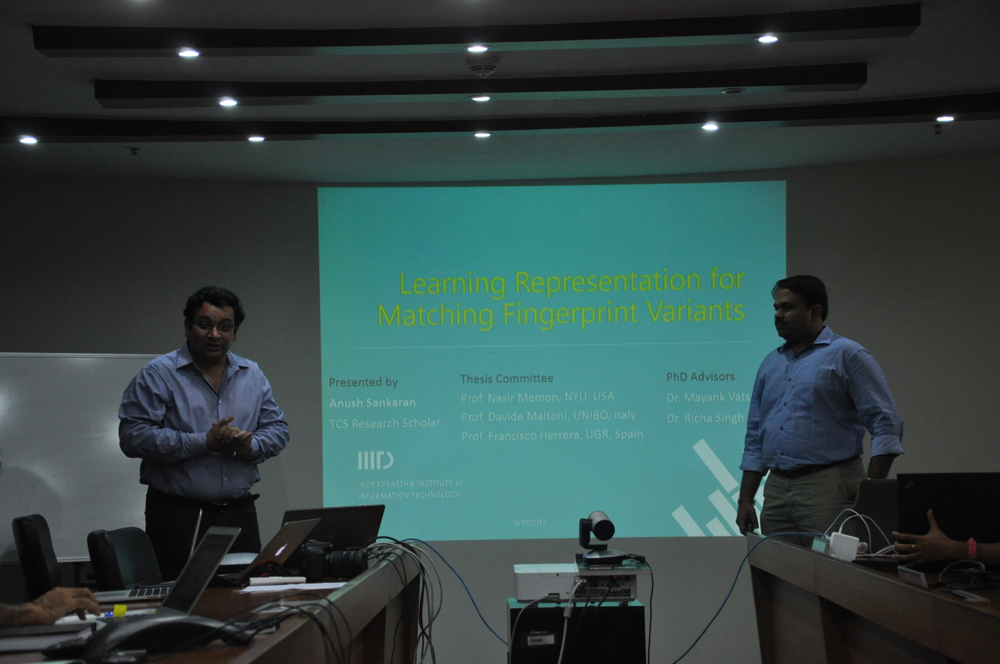
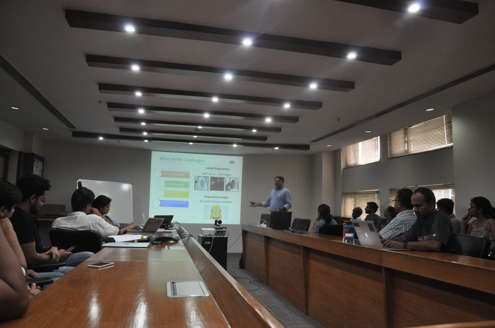
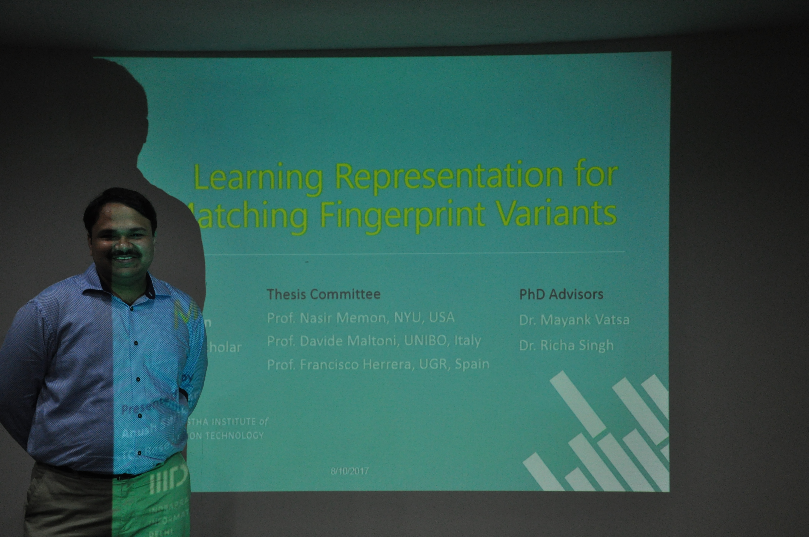
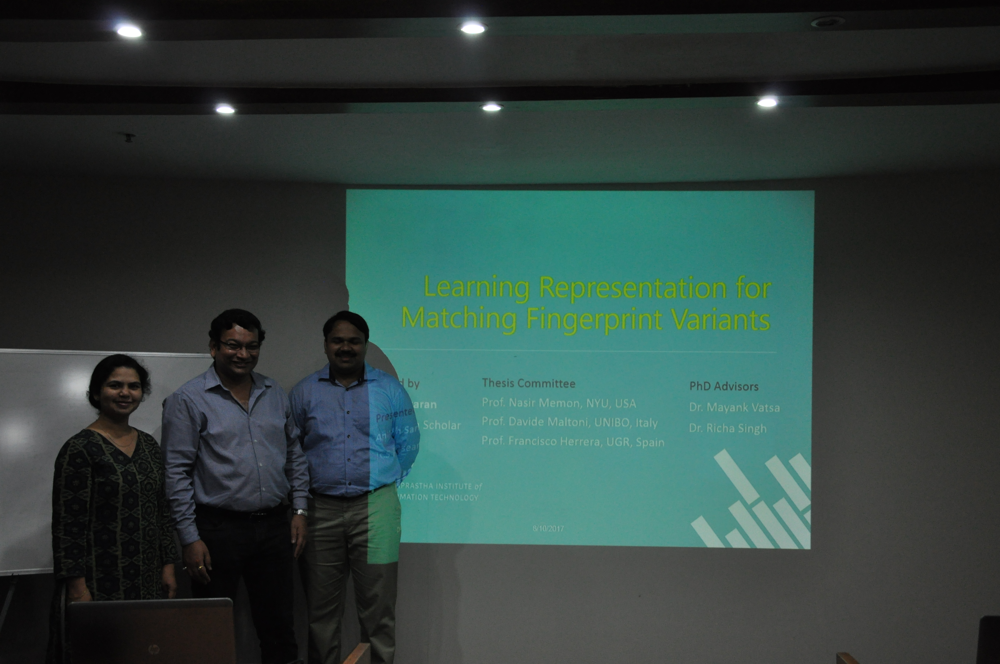

## PhD Thesis

On this August (10th) occasion, I defended my seven-year-long PhD thesis titled, "**Learning Representations for Matching Fingerprint Variants**" (I should probably write a seperate thesis explaning the process and the previous names considered, before arriving at this title!). 

The defense was chaired by some of the most revered and accomplished professors in this domain,
1. [Prof. Davide Maltoni](https://www.unibo.it/sitoweb/davide.maltoni/en), UNIBO
2. [Prof. Francisco Herrera](http://decsai.ugr.es/~herrera/), UGR
3. [Prof. Nasir Memon](http://engineering.nyu.edu/people/nasir-memon), NYU 

along with my thesis advisors,
1. [Dr. Mayank Vatsa](https://www.iiitd.edu.in/~mayank/), IIIT Delhi
2. [Dr. Richa Singh](https://www.iiitd.edu.in/~richa/), IIIT Delhi

## Thesis and Slides

> Learning Representations for Matching Fingerprint Variants [PDF](../docs/Thesis_Anush_1.pdf)

> Slide Deck [PPT](../docs/Thesis_slides_v2.pptx)

## Video of the talk

> [PhD Defense](https://youtu.be/D0OjXnmlbp0)

## Captured Moments

