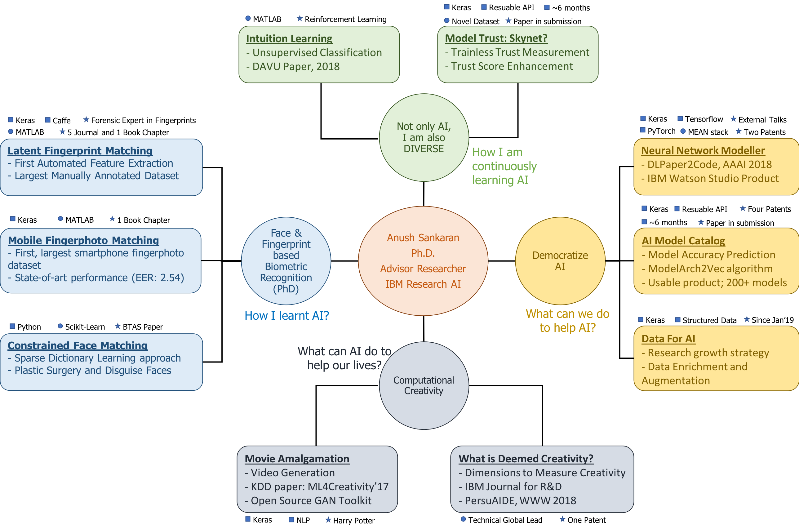

# What am I Doing in Research?

When I am having an unplanned holiday, I tend to have some time for myself - to think about my past, my present, and maybe my future. Especially, when I am having an unplanned holiday because I fell sick, I will reach my heights of introspection. 

The result of such a deep introspection is the modular break-up and highly colorized visualization of my research career and research interests, as shown in the following picture:

As the visualization suggests, I have learnt AI through multiple projects and research problems. I have used AI in many challenging problems, I have contributed towards AI to improve consummability, and I am continuously learning AI by taking up new challenging problems and frontiers. There were certain other memorable works in my resume which I am proud of. However, I could not fit them into this picture without adding a ``purely miscellaneous". For now, they could stay alone in some corner of my resume. 

I should say, I was sweetly pleased to come up with a perspective of my own research doings. I was getting some feeling that I was falling behind in research, however, this exercise hopefully is putting me back on track. I encourage everyone who could spare a few hours, to do a similar exercise - it surely helps!